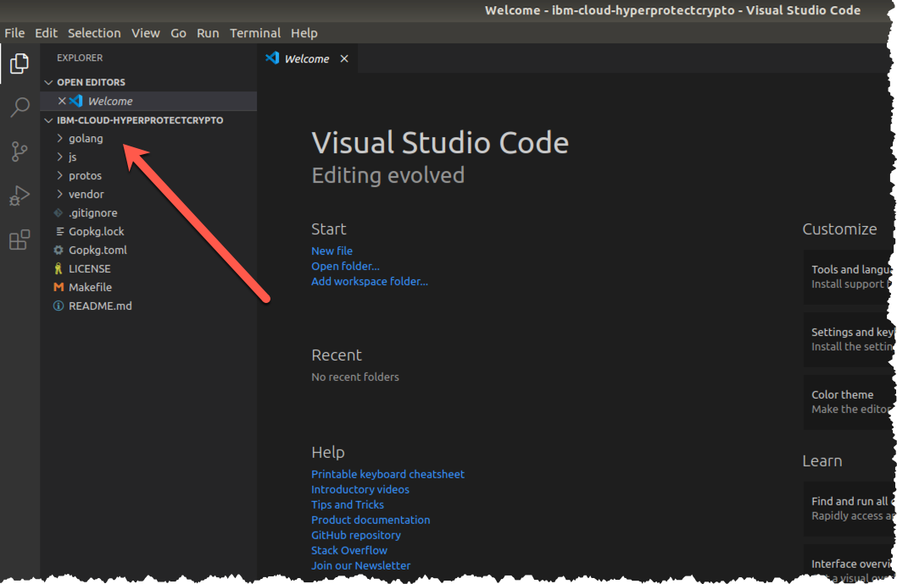
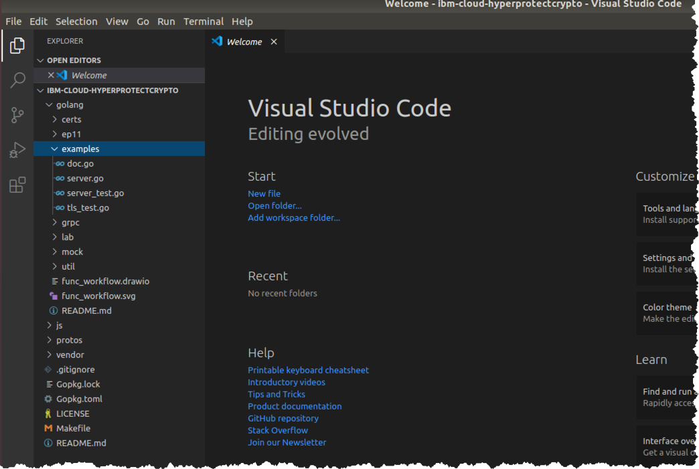
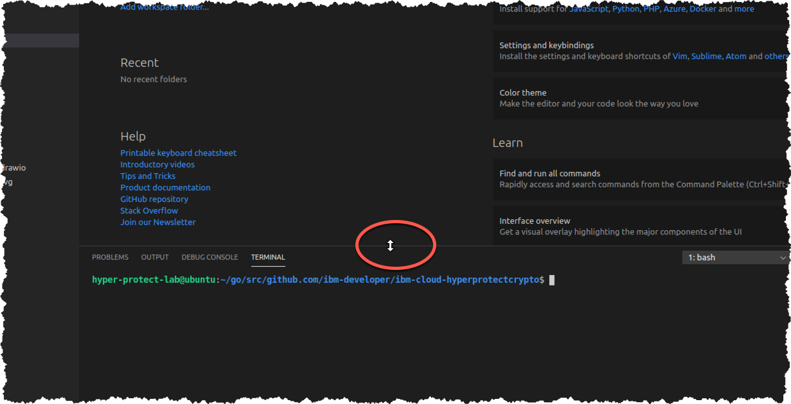
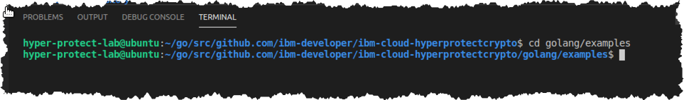

# Run the GREP11 Sample code

## Clone the GitHub repository which has the source code


1. Change to the `/home/hyper-protect-lab/go/src/github.com/ibm-developer` directory

    ``` bash
    cd ${HOME}/go/src/github.com/ibm-developer
    ```

2. Ensure you are in the directory mentioned in the prior step. You may be able to tell from the command prompt. 
You can also enter the `pwd` ("print working directory") to be sure, e.g.,:

    ``` bash
    pwd
    ```

    ???+ example "Example Output"

        ``` bash
        /home/hyper-protect-lab/go/src/github.com/ibm-developer
        ```

3. Clone the GitHub respository used in this lab:

    ``` bash
    git clone https://github.com/silliman/ibm-cloud-hyperprotectcrypto.git
    ```

    ???+ example "Example Output"

        ```
        Cloning into 'ibm-cloud-hyperprotectcrypto'...
        remote: Enumerating objects: 821, done.
        remote: Counting objects: 100% (821/821), done.
        remote: Compressing objects: 100% (551/551), done.
        remote: Total 821 (delta 227), reused 821 (delta 227), pack-reused 0
        Receiving objects: 100% (821/821), 9.30 MiB | 8.42 MiB/s, done.
        Resolving deltas: 100% (227/227), done.
        ```

4. Change to the `ibm-cloud-hyperprotectcrypto` directory which the prior `git clone` command created:

    ``` bash
    cd ibm-cloud-hyperprotect-crypto
    ```

    !!! tip
        Use the `pwd` command if you cannot already tell by your command prompt that you are in the `/home/hyper-protect-lab/go/src/github.com/ibm-developer/ibm-cloud-hyperprotectcrypto` directory.

## Run the GREP11 sample code

1. Start Visual Studio Code within your current directory:

    ``` bash
    code
    ```

    In a moment you should see the Visual Studio Code window with your current directory structure shown in the Explorer pane in the upper left corner of the window:

    

2. Expand the `golang` folder, and then expand the `examples` folder underneath it. Your Explorer pane should then look similar to this:

    

3. From the Visual Studio Code menu, select *View* then *Terminal*, as shown below:

    

4. You will see a terminal appear within Visual Studio Code at the bottom:

    

    !!! tip
        If you hover your mouse over the line above the terminal, when it turns into the "double arrow" as highlighted in the above screen snippet, you can drag the line to resize your terminal window. This tip may come in handy for you during the course of the lab.

5. Change to the `golang/examples` directory within the Visual Studio Code terminal that you just opened:

    ``` bash
    cd golang/examples
    ```
    
    Your terminal will look like this:

    

    !!! tip
        I have shown you how to use the Terminal window with Visual Studio Code, which you may find convenient.  Your Ubuntu Desktop also provides a Terminal application that you can use to open one or more terminal windows with.  They behave the same, and which one you use is a personal choice, as long as you are in the correct directory that the instructions expect you to be in.

        It is convenient to have a terminal window inside Visual Studio Code, but it comes at the expense of some screen real estate being taken away from the source code used in the exercises.

        Use whichever method works best for you.

6. Test the GREP11 sample code:

    ```bash
    go test -v
    ```

    ???+ example "Example Output"
    
        ```
        === RUN   Example_getMechanismInfo
        --- PASS: Example_getMechanismInfo (0.29s)
        === RUN   Example_encryptAndDecrypt
        --- PASS: Example_encryptAndDecrypt (0.84s)
        === RUN   Example_digest
        --- PASS: Example_digest (0.55s)
        === RUN   Example_signAndVerifyUsingRSAKeyPair
        --- PASS: Example_signAndVerifyUsingRSAKeyPair (0.50s)
        === RUN   Example_signAndVerifyUsingECDSAKeyPair
        --- PASS: Example_signAndVerifyUsingECDSAKeyPair (0.52s)
        === RUN   Example_signAndVerifyToTestErrorHandling
        --- PASS: Example_signAndVerifyToTestErrorHandling (0.51s)
        === RUN   Example_wrapAndUnwrapKey
        --- PASS: Example_wrapAndUnwrapKey (0.41s)
        === RUN   Example_deriveKey
        --- PASS: Example_deriveKey (0.61s)
        === RUN   Example_tls
        --- PASS: Example_tls (0.40s)
        PASS
        ok      github.com/ibm-developer/ibm-cloud-hyperprotectcrypto/golang/examples   4.653s
        ```

## Explanation of GREP11 sample code

The test used the *go test* subcommand, which does the following:

1. It looks for any file in the current directory named *something*_test.go. There are two such files in our directory, *server_test.go* and *tls_test.go*.

2. It looks for functions in these files named Example_*something*, and executes these functions.

3. At the bottom of each of these functions, a series of comment lines, starting with a header line, specifies what the expected output from the function should be. If the output from the function call matches the lines (except for the header line), then the test passes.  Otherwise the test fails.

In the explorer pane, click on *server_test.go* or *tls_test.go* and examine the source code to see these lines.  For example, lines 211-216 in *server_test.go* indicate what the expected output of the *Example_encryptAndDecrypt* function should be:

``` bash
// Output:
// Generated AES Key
// Generated IV
// Encrypted message
// Decrypted message
// Hello, this is a very long and creative message without any imagination
```

!!! Note
    Go is a compiled language, and there are no executable files in this directory-  the 'go test' command compiles the source code in the directory into an executable file in order to run the tests, and then cleans up afterwards by removing this executable.

Here is an itemization of the functions that our `go test -v` command tested, with a brief description of each.  Our lab exercises in the subsequent sections will go into a little more depth on some of the more interesting of these functions.

1. *Example_getMechanismInfo* gets a list of PKCS #11 Mechanisms and then retrieves information about one of them.  We will delve deeper into this in the first exercise.

2. *Example_encryptAndDecrypt* creates a secret (i.e., symmetric) key, encrypts data with it, then decrypts it, and ensures the data was unchanged after going through the encryption and decryption.  We will look more into this in the second exercise.

3. *Example_digest* creates a digest, or hash, against some data.  A hash is a fixed-length, unique fingerprint for a set of input data of any size.  Since there are an infinite number of possible input combinations, and the hash is fixed-length, in theory two different sets of data could produce the same hash.  This is called a *collision*.  In practice, the hash is of sufficient size, and the algorithm to produce it sufficiently complex, that it is computationally infeasible to produce the same hash with two different sets of input.  Digests are used in digital signatures, which the next two tests cover.

4. *Example_signAndVerifyUsingRSAKeyPair* creates an RSA public and private key pair and uses the private key to create a digital signature and the public key to verify the digital signature.

5. *Example_signAndVerifyUsingECDSAKeyPair* creates and elliptic curve public and private key pair and uses the private key to create a digital signature and uses the public key to verify the digital signature. We go into greater depth (and discuss the differences between RSA and Elliptic Curves) in the third exercise.

6. *Example_signAndVerifyToTestErrorHandling* intentionally causes an error-  after a signature is created, the program modifies a byte in it, so that when the signature is verified later, an error occurs- the test passes because the expected error message is listed in the expected test output.

7. *Example_wrapAndUnwrapKey* creates a public and private key pair and uses the public key to encrypt, or wrap, a symmetric key, which can then only be decrypted, or unwrapped, by the private key.  The fourth and final exercise covers this topic.

7. *Example_deriveKey* illustrates a common algorithm where two sides of a connection each have a public and private key pair, and they use each other's public key in an algorithm that allows each of them to derive an identical secret, i.e., symmetric, key, without ever having sent that secret key across the connection.  This is a common use case because encryption and decryption with a symmetric key is much faster than encryption and decryption with public and private keys.  The two parties use relatively slow public key cryptography to derive this shared symmetric key at the beginning of their session, and then switch to using this symmetric key for the remainder of the session.  This function and all of the functions preceding it in this list are in the *server_test.go* source file.

8. *Example_tls* creates an X.509 certificate, starts up an http server that uses this certificate, and has a client connect to the server with TLS authentication, which uses this certificate to establish a session.  This test is in the *tls_test.go* source file.
