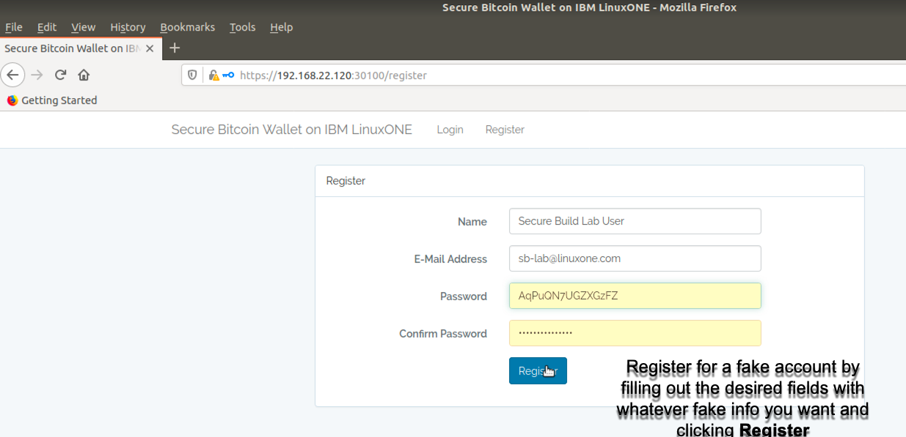
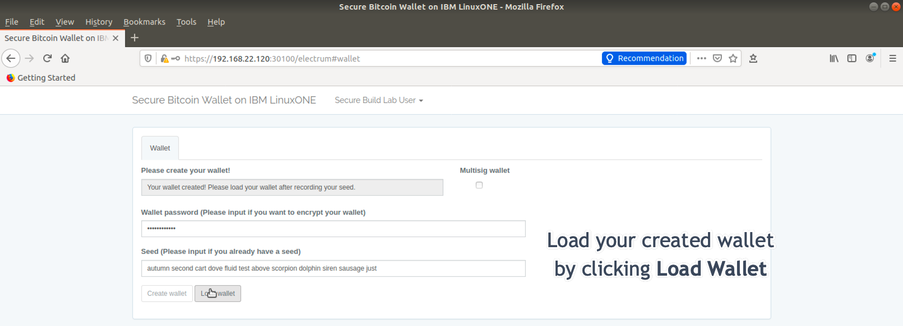
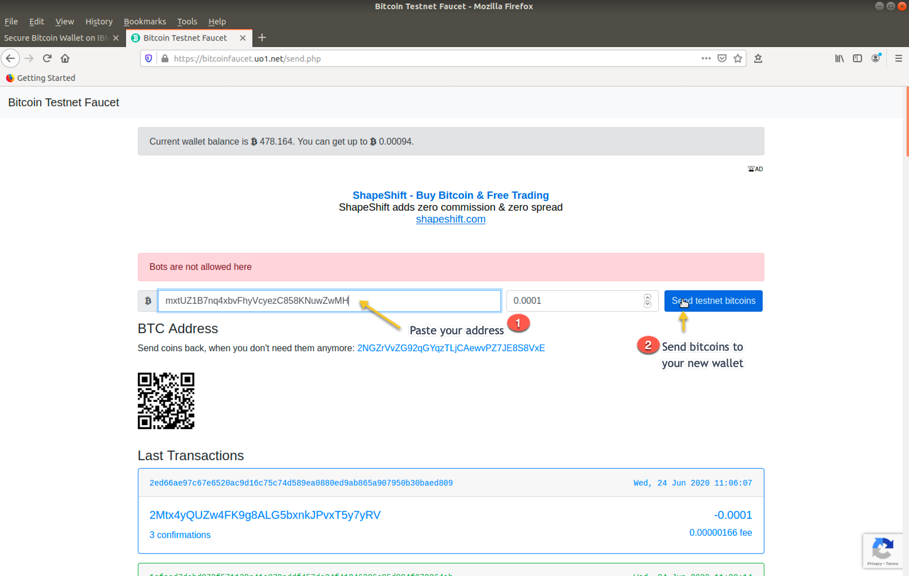
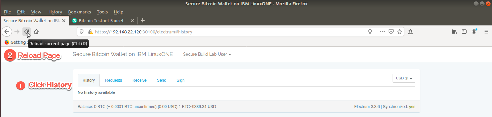
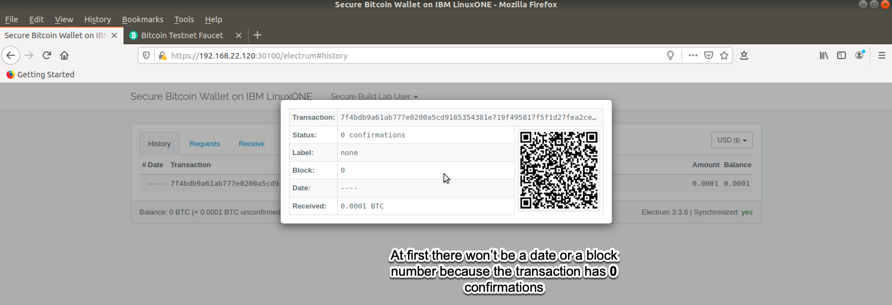
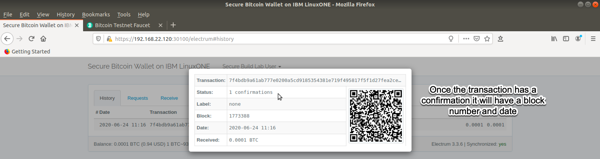
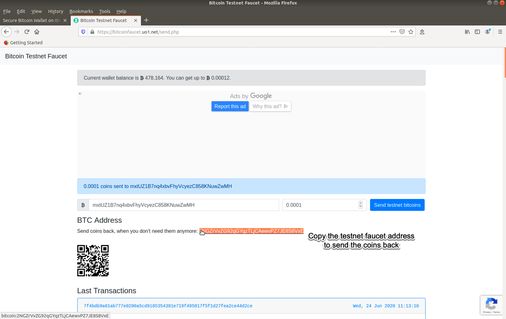
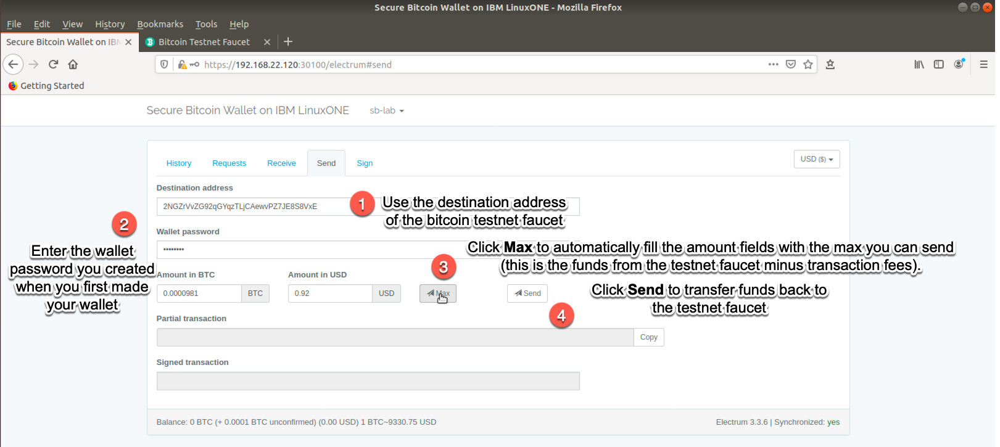
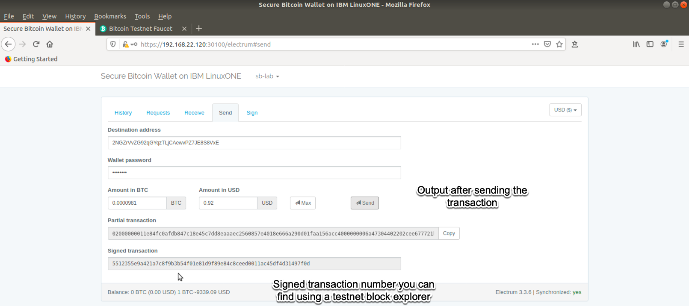
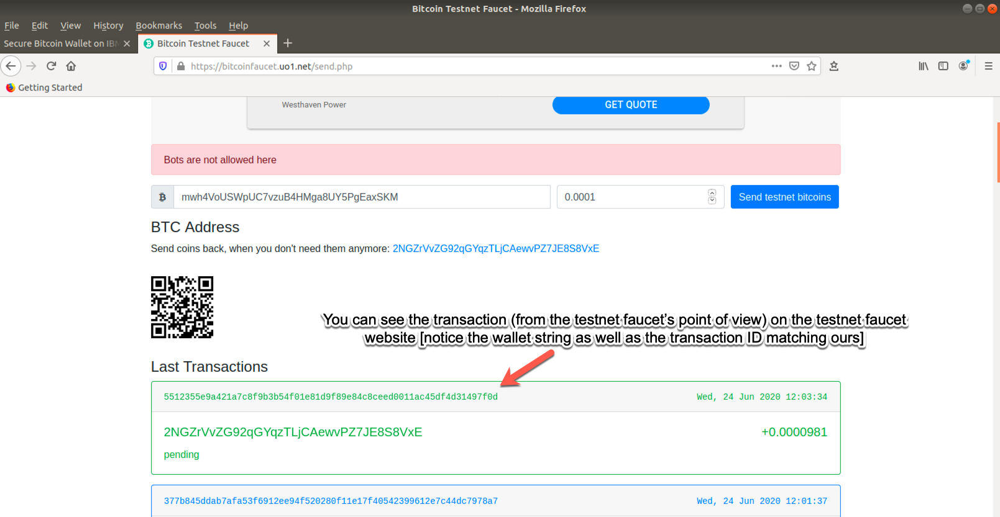

# Welcome to the Secure Bitcoin Wallet on IBM LinuxONE

## Overview

This application is a secure [Electrum](https://electrum.org/#home){target=_blank} Bitcoin wallet found at [this GitHub repository](https://github.com/IBM/secure-bitcoin-wallet){target=_blank}. You can use it to store the identities necessary to transact on the Bitcoin public blockchain network. While this version of the wallet is just a proof of concept, running this type of wallet on Hyper Protect enables you to protect your digital assets from bad actors such as malicious server administrators.

!!! info
    This Electrum Bitcoin wallet functions regularly, while inheriting the security benefits of the Hyper Protect Virtual Server platform. This ensures that a legitimate version of the application is running (Secure Image Build process) and that administrators cannot compromise the application (Hyper Protect Virtual Server deployment).

## Account Registration

Registering a fake account for lab purposes.

1. Choose `Register` since you won't have an existing account on the newly deployed server.

    

2. Enter the registration details you desire.

    

    !!! Tip
        Do not worry about the information you enter on the registration page (shown below) as it won't map to anything. You just need your password to log back in if you log out of the application.

## Wallet initialization

It's time to set up your Secure Electrum Bitcoin wallet itself! :zap:

1. Bring up the wallet screen

    

2. Enter in a `password` for your wallet and click `Create Wallet`

    

3. Load your newly created wallet to enable it

    

4. Reload the page.

    

5. Your wallet is ready for use in all of its glory :angel:

    

## Receiving Bitcoins

A wallet without currency is blasphemy, so it's time to fill it on up with fake bitcoins.

1. Go to the `Receive` section of the wallet and get the bitcoin wallet address.  

    

    !!! info
        This is the address whose alloted bitcoins you lay claim to.

2. Open [this bitcoin test faucet site](https://bitcoinfaucet.uo1.net/send.php){target=_blank} [click on the link] and use it to transfer bitcoin value to the `Receiving address` in your wallet **from step 1 above**.

    

    !!! note
        Instead of transacting on the "real" bitcoin blockchain network, we are using a [testnet](https://medium.com/myetherwallet/understanding-blockchain-changes-testnets-and-mainnets-c2171a8e835f){target=_blank}. This means that the network participants agree that the assets on the network have no value. Testnets are used for testing changes to the network, testing applications and introducing new users to the technical aspects of network. There are testnets for many of the public blockchain networks including of course bitcoin and ethereum. Test faucets (like the one we are using) act as distributors of tokens to other users on the testnet.

3. Switch back to your wallet tab and go to the `History` section and then reload the page.

    

4. You should now see your wallet address as the recipient of a `pending transaction` from the bitcoin testnet faucet.

    

5. After clicking for more information you get a detailed transaction overview

    

    !!! info
        The number of [confirmations](https://en.bitcoin.it/wiki/Confirmation){target=_blank} a block receives is the number of blocks deep the block that has included the blockchain transaction is. In other words, `1 confirmation` means that the current head block includes the transaction. `2 confirmations` means that the current head blocks parent block contains the transaction and so on. The deeper the transaction is (more confirmations it has) the more mining power it would take to "reverse history" and undo the transaction.

    Since there are `0 confirmations` in the picture above, it means that the transaction is not yet included in a block. This is why it has no timestamp yet and it's block number is listed as `0`.

6. After waiting anywhere from a minute to a few minutes (depending on the current testnet traffic) you should see a confirmation on your transaction.

    !!! Tip
        You will need to keep reloading the page for it to update. It doesn't update automatically.

    

    There is now a timestamp and a block number! :dollar:

    !!! info
        As time passes more confirmations will accumulate. You can check on the `confirmations` again at the end of the lab to show yourself this (Given enough time has passed for one or more additional confirmation(s) to occur).

## Returning Bitcoins

Since you are feeling charitable you decide to transfer your testnet value back to the faucet's address.

1. Go back to [the faucet site](https://bitcoinfaucet.uo1.net/send.php){target=_blank} and get its bitcoin address

    

    !!! tip
        This address is here for easy copy and paste (ensure this matches what the application shows in the browser before using this, as the bitcoin address they use for returning funds changes occasionally):

        ``` bash
        tb1qm5tfegjevj27yvvna9elym9lnzcf0zraxgl8z2
        ```

2. Send bitcoins to faucet using `Send` section of wallet

    

3. Once sent you will see the `Signed transaction` information filled out on your wallet page.

    

4. You can go back to the [bitcoin faucet site](https://bitcoinfaucet.uo1.net/send.php){target=_blank} and see the transaction as green there with a sender of your address and a transaction ID matching the one you sent.

    

5. You can view both the initial received transaction and the newly sent transaction in the `History` tab of your bitcoin wallet.

    !!! Tip
        You have to keep reloading the page for it to update with new confirmations.

    !!! info
        If you wait long enough, eventually these transactions will gain confirmations as in the picture below

    

6. You can continue to play around with the electrum wallet before moving on.

## Summary

!!! Success

    You have participated in the bitcoin testnet using a securely built electrum bitcoin wallet powered by a Hyper Protect Virtual Server. Congratulations!!! 

:rocket:

Now, it's time to clean up...
