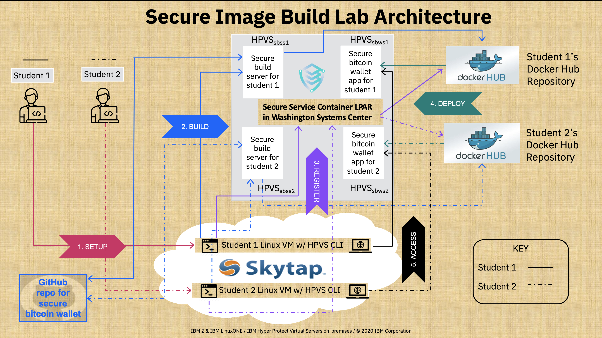

# Hyper Protect Virtual Servers (HPVS) Lab Process Overview

## Prerequisites

See the [`Prerequisites` page](../prerequisites.md){target=_blank} to complete the prerequisites for this lab. This includes creating accounts and credentials to access the Source Code Management (SCM) [GitHub](https://github.com){target=_blank} and the Docker Image Management (Docker Registry) [Docker Hub](https://hub.docker.com/){target=_blank} for the lab.

## The Big Picture

Here is a big picture of what is going on in the lab (i.e. lab architecture).

!!! note
    Student 1 and Student 2 in the illustration are 2 example students. In the actual lab, more students will be present.

The 5 different pieces of this puzzle:

1. [SETUP](#setup)
2. [BUILD](#build)
3. [REGISTER](#register)
4. [DEPLOY](#deploy)
5. [ACCESS](#access)

(and how to [CLEAN UP](#cleanup)) are explained in more detail in their respective sections below.

### SETUP

Configure your environment with the necessary credentials to connect to [GitHub](https://github.com){target=_blank} and [Docker Hub](https://hub.docker.com/){target=_blank} respectively ([see `Configuring your Environment`](securebuild-setup.md){target=_blank}).

### BUILD

Securely build a Docker Image for the [Secure Electrum Bitcoin Wallet Application](https://github.com/IBM/secure-bitcoin-wallet){target=_blank}. ([see `Create your HPVS Secure Build Server`](create-server.md){target=_blank} and [`Securely Build your Application`](build.md){target=_blank}). This uses the Secure Build Process detailed below[^1]:

!!! tip "Securely Seeding Docker Content Trust"
    This Secure Build Process leverages a **Hyper Protect Virtual Server**, called the Secure Build Server, to establish trust and security in the [Docker Content Trust](https://docs.docker.com/engine/security/trust/content_trust/){target=_blank} process. This ensure images verified using the [Notary service architecture](https://docs.docker.com/notary/service_architecture/){target=_blank} were safely built and signed. This is done by generating the repository and root keys used to establish trust with the [Notary Service](https://docs.docker.com/notary/service_architecture/){target=_blank} inside of the Secure Build server to guarantee that the initial keys used for a repository are trusted on first use (solving the [TOFU](https://en.wikipedia.org/wiki/Trust_on_first_use){target=_blank} problem).

    However, those aren't the  only keys used throughout the lab. The table below illustrates all of the different keys used throughout the secure build process, what they do, how they are created, and who is ultimately responsible for them.

???+ example "List of the keys employed during the Secure Build Lab in order of creation. [^2]"
    | Key Name                    | Key Type | Key Function                                                                                                                             | Private Key Location                        | How Created                                 | Owner                        |
    | --------------------------- | -------- | ---------------------------------------------------------------------------------------------------------------------------------------- | :-------------------------------------------: | -------------------------------------------------------------------  | ---------------------------- |
    | `HPVS Registry CLI Encryption Key`                                 | [AES](https://en.bitcoinwiki.org/wiki/Advanced_Encryption_Standard_(AES)){target=_blank} 256 bit key | Encrypts the Docker token you provide as part of the `hpvs registry add` command in [this section of the lab](securebuild-setup.md#add-docker-registry-to-use-for-secure-build){target=_blank} | :fontawesome-brands-linux:   Client Linux VM (i.e. Skytap for the lab) | This symmetric key is hardcoded in the HPVS CLI binary file downloaded on the Skytap instance prior to the lab | IBM HPVS Developers |  
    | `GitHub` :octicons-mark-github-16: `SSH Key`                           | [RSA](https://www.drdobbs.com/rsa-digital-signatures/184404605){target=_blank} 4096 bit key pair | Provides SSH access to GitHub account to clone repositories via SSH | :fontawesome-brands-linux:   Client Linux VM (i.e. Skytap for the lab) as well as the secure build server | In [this section](securebuild-setup.md#create-ssh-key-and-grant-github-access){target=_blank} of the `SETUP` process | ISV or application developer |
    | `Secure Build Server Client Certificate and Key` | [RSA](https://www.drdobbs.com/rsa-digital-signatures/184404605){target=_blank} key pair | securely communicate with the secure build server over the Secure Build REST API | :fontawesome-brands-linux:   Client Linux VM (i.e. Skytap for the lab) | Generated in [this section of the lab](create-server.md#create-certificate-and-key-for-server-side-certificate-checking-in-tls){target=_blank} and the public key is passed to the server when creating the secure build server | ISV or application developer or Cloud Admin |
    | `Repository Registration Signing Key` | [RSA](https://www.drdobbs.com/rsa-digital-signatures/184404605){target=_blank} 4096 bit key pair (encrypted using GPG utility) (signatures use [SHA256](https://en.bitcoinwiki.org/wiki/SHA-256){target=_blank} hashing) | The private key signs the repository definition file and the public key verifies this signature. Needed to create and update repositories defined on a Hyper Protect Virtual Servers appliance | :fontawesome-brands-linux:   Client Linux VM (i.e. Skytap for the lab) | By the [GnuPG utility](https://gnupg.org/gph/en/manual.html){target=_blank} using the `gpg --generate-key` command in [this section of the lab](build.md#create-repository-registration-gpg-signing-key){target=_blank} | ISV or application developer |
    | `Root Key`               | [ECDSA](https://en.bitcoinwiki.org/wiki/Elliptic_Curve_Digital_Signature_Algorithm){target=_blank} (NIST P-256 curve) 256 bit key pair (signatures use [SHA256](https://en.bitcoinwiki.org/wiki/SHA-256){target=_blank} hashing) | Signs the `root.json` metadata file which specifies which keys are valid for image signing, snapshots, and timestamps for a given secure build server |    Encrypted in Secure Build Server Quotagroup | In response to the `hpvs sb build` command, Docker Content Trust CLI generates this key on the secure build server on first push to remote Docker repository in [this section of lab](build.md#build-application){target=_blank}   | ISV or application developer |
    | `Image Signing "Targets" Key` | [ECDSA](https://en.bitcoinwiki.org/wiki/Elliptic_Curve_Digital_Signature_Algorithm){target=_blank} (NIST P-256 curve) 256 bit key pair (signatures use [SHA256](https://en.bitcoinwiki.org/wiki/SHA-256){target=_blank} hashing) | Signs the `targets.json` metadata file which specifies the hashes of securely built Docker images                                                       |    Encrypted in Secure Build Server Quotagroup | In response to the `hpvs sb build` command, Docker Content Trust CLI generates this key on the secure build server on first push to a remote Docker repository in [this section of lab](build.md#build-application){target=_blank} | ISV or application developer |
    | `Snapshot Key`           | [ECDSA](https://en.bitcoinwiki.org/wiki/Elliptic_Curve_Digital_Signature_Algorithm){target=_blank} (NIST P-256 curve) 256 bit key pair (signatures use [SHA256](https://en.bitcoinwiki.org/wiki/SHA-256){target=_blank} hashing) | Signs the `snapshot.json` metadata file which specifies the filenames, sizes, and hashes of the `targets.json` and `root.json` metadata files to prevent mix and match attacks  | :fontawesome-brands-docker:   Stored encrypted using [Javascript Object Signing and Encryption](https://github.com/dvsekhvalnov/jose2go){target=_blank} in the image registry's signer database [see Notary Service Architecture for more detail](https://docs.docker.com/notary/service_architecture/#architecture-and-components){target=_blank} | By the Notary server on the first push to a given Docker repository (triggered by `hpvs sb build` in [this section of the lab.](build.md#build-application){target=_blank}) | Image registry administrator |
    | `Timestamp Key`           | [ECDSA](https://en.bitcoinwiki.org/wiki/Elliptic_Curve_Digital_Signature_Algorithm){target=_blank} (NIST P-256 curve) 256 bit key pair (signatures use [SHA256](https://en.bitcoinwiki.org/wiki/SHA-256){target=_blank} hashing) | Frequently signs the `timestamp.json` metadata file which specifies the hash and size of the `snapshot.json` file at the current time to provide freshness guarantees without needing to re-download content on the client side | :fontawesome-brands-docker:   Stored encrypted using [Javascript Object Signing and Encryption](https://github.com/dvsekhvalnov/jose2go){target=_blank} in the image registry's signer database [see Notary Service Architecture for more detail](https://docs.docker.com/notary/service_architecture/#architecture-and-components){target=_blank} | Initially by the Notary server on the first push to a given Docker repository (triggered by `hpvs sb build` in [this section of the lab.](build.md#build-application){target=_blank}) This key has the shortest expiry time and is frequently rotated by the image registry's Notary server | Image registry administrator |
    | `Manifest Signing Key`           | [RSA](https://www.drdobbs.com/rsa-digital-signatures/184404605){target=_blank} 2048 bit key pair (signatures use [SHA256](https://en.bitcoinwiki.org/wiki/SHA-256){target=_blank} hashing) | The secure build server uses the private key to sign the manifest bundle which contains the source code used to build the docker image, any ssh keys (the public part) that could have access to the server (if enabled), and the logs and status of the secure build at the time of image signing. |    Encrypted in Secure Build Server Quotagroup | Created at the end of the secure build after each `hpvs sb build` in [this section of the lab](build.md#build-application){target=_blank}. The corresponding public key and the manifest itself are retrieved securely (using the `Secure Build Server Client Certificate and Key`) by the client VM to verify the build in [this section of the lab](build.md#verify-your-application){target=_blank} | ISV or application developer |

[^1]: The `Secure Build Experience` graphic is adapted from charts provided by the Hyper Protect Virtual Servers On-Premises development team.
[^2]: The above table explains all of the keys used for this lab, expounding on the more general table provided in the [IBM Knowledge Center](https://www.ibm.com/support/knowledgecenter/en/SSHPMH_1.2.x/120x_topics/keys_in_securebuild.html){target=_blank} with specific details for the lab and omitting keys not used during the course of the lab.

### REGISTER

Register your securely built Docker Image with your Secure Service Container to verify its validity[^3] (see the end of [`Securely Build your Application`](build.md){target=_blank} and the beginning of [`Deploy your Securely Built Application as a Hyper Protect Virtual Server`](deploy-app.md){target=_blank}).

[^3]: The `Image Registration Experience` graphic is adapted from charts provided by the Hyper Protect Virtual Servers On-Premises development team.

### DEPLOY

Deploy your Secure Bitcoin Wallet application `(from the verified repository created in step 3)` as a Hyper Protect Virtual Server within its own secure enclave[^4] (see [`Deploy your Securely Built Application as a Hyper Protect Virtual Server`](deploy-app.md){target=_blank}).

[^4]: The `Hyper Protect Virtual Server Experience` graphic is adapted from charts provided by the Hyper Protect Virtual Servers On-Premises development team.

### ACCESS

Access your [Secure Electrum Bitcoin Wallet Application](https://github.com/IBM/secure-bitcoin-wallet){target=_blank} application to use it with security built-in (see [`Welcome to the Secure Bitcoin Wallet on IBM LinuxONE`](bitcoin_wallet.md){target=_blank}).

### CLEANUP

Clean up your environment for future users (see [`Clean up your environment`](cleanup.md){target=_blank}).
