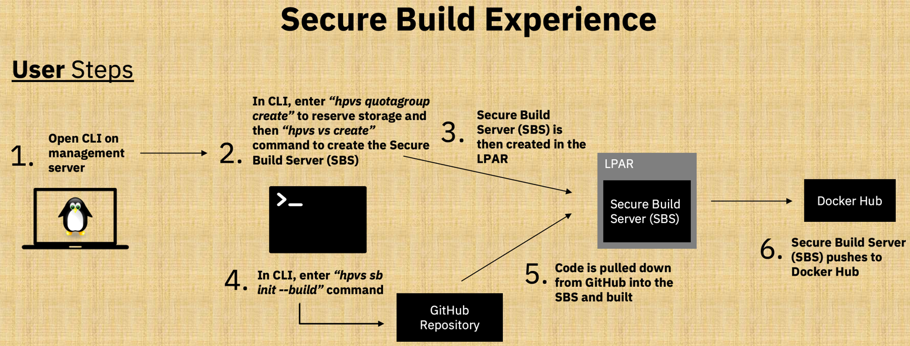
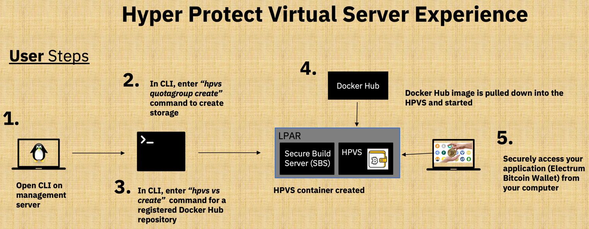

# Hyper Protect Virtual Servers (HPVS) Lab Process Overview

## Prerequisites

See the [`Prerequistes` page](../prerequisites.md){target=_blank} to complete the prerequites for this lab. This includes creating accounts and credentials to access the Source Code Management (SCM) [GitHub](https://github.com){target=_blank} and the Docker Image Management (Docker Registry) [Docker Hub](https://hub.docker.com/){target=_blank} for the lab.

## Detailed Lab Process

1. Configure your environment with the necessary credentials to connect to [GitHub](https://github.com){target=_blank} and [Docker Hub](https://hub.docker.com/){target=_blank} respectively. ([See `Configuring your Environment`](securebuild-setup.md){target=_blank})

2. Securely Build a Docker Image for the [Secure Electrum Bitcoin Wallet Application](https://github.com/IBM/secure-bitcoin-wallet){target=_blank}. ([see `Create your HPVS Secure Build Server`](create-server.md){target=_blank} and [`Securely Build your Application`](build.md){target=_blank}). This uses the Secure Build Process detailed below[^1]:

    

    !!! info
        This secure build process leverages [Docker Content Trust](https://docs.docker.com/engine/security/trust/content_trust/){target=_blank} to verify images using the [Notary service architecture](https://docs.docker.com/notary/service_architecture/){target=_blank}.

    !!! tip
        The Secure Build server used is deployed as a **Hyper Protect Virtual Server** which generates the repository and root keys used to establish trust with the [Docker Notary Service](https://docs.docker.com/notary/service_architecture/){target=_blank}. This ensures that the initial keys used for a repository are trusted on first use (solving the [TOFU](https://en.wikipedia.org/wiki/Trust_on_first_use){target=_blank} problem). See a detailed example of where all of the keys used for the secure build process are generated below.

        ???+ example "Full list of the keys used during the Secure Build and BYOI lifecycle[^2]" 
            

[^1]: The `Secure Build Experience` graphic is adapted from charts provided by the Hyper Protect Virtual Servers On-Premises development team.
[^2]: The above table is provided here for convenience. It comes from the `IBM Knowledge Center`

3. Register your securely built Docker Image with your Secure Service Container to verify its validity[^3] (see the end of [`Securely Build your Application`](build.md){target=_blank} and the beginning of [`Deploy your Securely Built Application as a Hyper Protect Virtual Server`](deploy-app.md){target=_blank})
.

[^3]: The `Image Registration Experience` graphic is adapted from charts provided by the Hyper Protect Virtual Servers On-Premises development team.

4. Launch your Secure Bitcoin Wallet application `(from the verified repository created in step 3)` as a Hyper Protect Virtual Server within its own secure enclave[^4] (see [`Deploy your Securely Built Application as a Hyper Protect Virtual Server`](deploy-app.md){target=_blank}).
.

[^4]: The `Hyper Protect Virtual Server Experience` graphic is adapted from charts provided by the Hyper Protect Virtual Servers On-Premises development team.

5. Access your [Secure Electrum Bitcoin Wallet Application](https://github.com/IBM/secure-bitcoin-wallet){target=_blank} application to use it with security built-in (see [`Welcome to the Secure Bitcoin Wallet on IBM LinuxONE`](bitcoin_wallet.md){target=_blank}).

6. Clean up your environment for future users (see [`Clean up your environment`](cleanup.md){target=_blank}).

## Let's Get Started!!!